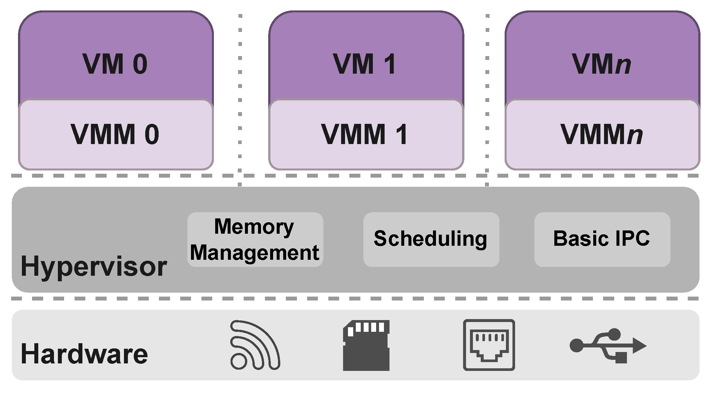

# 01 - O que é virtualização

A virtualização surgiu na década de 60, com o objetivo de compartilhar recursos de hardware entre vários usuários. A ideia era que cada usuário tivesse a sensação de que o hardware era dedicado para ele, mas na verdade, o hardware era compartilhado entre vários usuários.

A virtualização de hardware é feita através de um software chamado de hypervisor, que é responsável por criar e gerenciar as máquinas virtuais. O hypervisor é instalado diretamente no hardware e é responsável por criar e gerenciar as máquinas virtuais.

Existem dois tipos de hypervisor:
- Tipo 1: O hypervisor é instalado diretamente no hardware e é responsável por criar e gerenciar as máquinas virtuais.
- Tipo 2: O hypervisor é instalado sobre um sistema operacional e é responsável por criar e gerenciar as máquinas virtuais.

O conceito de hypervisor vem de supervisor, que é um software que gerencia o hardware. O hypervisor é um supervisor de um supervisor, ou seja, é um software que gerencia um software que gerencia o hardware. Este termo foi usado pela primeira vez em 1966 pela IBM por R Adair, R Bayles no paper "A Virtual Machine System for the 360/40".

A virtualização de hardware é muito utilizada em ambientes corporativos, pois permite que um único servidor seja dividido em vários servidores virtuais, o que reduz o custo de aquisição de hardware.

Na década de 60 a IBM desenvolveu o CP-40, a primeira versão do CP/CMS, que foi o primeiro sistema operacional a implementar a virtualização de hardware. O CP/CMS foi o precursor do VM/CMS, que foi o primeiro sistema operacional a implementar a virtualização de hardware em larga escala.

## Hypervisor

Um pedaço de software que permite que um computador hospede vários sistemas operacionais ao mesmo tempo. O hypervisor é instalado diretamente no hardware ou sobre um sistema operacional e é responsável por criar e gerenciar as máquinas virtuais.

### Virtual Machine Monitor

Quando o hardware não está disponível diretamente na máquina virtual, o VMM engana o sistema operacional convidado para que ele acredite que está sendo executado diretamente no hardware. O VMM intercepta as instruções do sistema operacional convidado e as traduz para o hardware real.

A VMM precisa satisfazer 3 propriedades:

- Equivalência: Precisa ser o mesmo, com ou sem a virtualização. Isto significa que a maioria das instruções precisam ser executadas sem nenhuma tradução.

- Performance: Precisa ser rápido o suficiente para não degradar o desempenho do sistema operacional convidado.

- Isolamento: Precisa isolar os convidados uns dos outros.

## Virtualização de memória

A virtualização de memória é uma técnica que permite que um sistema operacional convidado acesse a memória física do sistema. O sistema operacional convidado acredita que está acessando a memória física, mas na verdade está acessando a memória virtual.

Algumas técnicas de virtualização de memória:

- Guest Virtual Memory: É o que o processo rodando consegue ver.
- Guest Physical Memory: É o que o SO convidado consegue ver.
- System Physical Memory: É o que o a VMM consegue ver.

## Virtualização de CPU

A virtualização de CPU é uma técnica que permite que um sistema operacional convidado acesse a CPU do sistema. O sistema operacional convidado acredita que está acessando a CPU, mas na verdade está acessando a CPU virtual.

### Binary Translation

O SO convidado é usado sem nenhuma modificação. As instruções do SO convidado são interceptadas e traduzidas para o hardware real. Isto causa uma degradação no desempenho.

### Paravirtualização

Para resolver problemas de performance, o SO convidado é modificado para que ele saiba que está rodando em um ambiente virtualizado e sua interação com o host é otimizado para evitar a degradação de desempenho.

Fontes:

- Livro: Linux Containers and Virtualization (Shashank Mohan Jain)
- [https://en.wikipedia.org/wiki/Timeline_of_virtualization_development](https://en.wikipedia.org/wiki/Timeline_of_virtualization_development)
- [https://en.wikipedia.org/wiki/Hypervisor](https://en.wikipedia.org/wiki/Hypervisor)
- [https://softwareengineering.stackexchange.com/questions/196405/how-did-the-term-hypervisor-come-into-use](https://softwareengineering.stackexchange.com/questions/196405/how-did-the-term-hypervisor-come-into-use)

